# 鄉鎮導航

本提圖旨在管理全台灣所有縣市與鄉鎮的「內容富化 (Enrichment)」進度。

## 📊 富化現況總覽 (Enrichment Roadmap)

| 縣市 | 狀態 | 鄉鎮進度 |
| :--- | :--- | :--- |
| [新竹市](?map=taiwan_admin_enrichment&feature=COUNTY_10018_新竹市) | `DEEP_RESEARCHED` | 3/3 |
| [臺南市](?map=taiwan_admin_enrichment&feature=COUNTY_67000_臺南市) | `AI_ENRICHED` | 37/74 |
| [南投縣](?map=taiwan_admin_enrichment&feature=COUNTY_10008_南投縣) | `DEFAULT` | 0/13 |
| [嘉義市](?map=taiwan_admin_enrichment&feature=COUNTY_10020_嘉義市) | `DEFAULT` | 0/3 |
| [嘉義縣](?map=taiwan_admin_enrichment&feature=COUNTY_10010_嘉義縣) | `DEFAULT` | 0/28 |
| [基隆市](?map=taiwan_admin_enrichment&feature=COUNTY_10017_基隆市) | `DEFAULT` | 0/10 |
| [宜蘭縣](?map=taiwan_admin_enrichment&feature=COUNTY_10002_宜蘭縣) | `DEFAULT` | 0/19 |
| [屏東縣](?map=taiwan_admin_enrichment&feature=COUNTY_10013_屏東縣) | `DEFAULT` | 0/33 |
| [彰化縣](?map=taiwan_admin_enrichment&feature=COUNTY_10007_彰化縣) | `DEFAULT` | 0/41 |
| [新北市](?map=taiwan_admin_enrichment&feature=COUNTY_65000_新北市) | `DEFAULT` | 0/58 |
| [新竹縣](?map=taiwan_admin_enrichment&feature=COUNTY_10004_新竹縣) | `DEFAULT` | 0/13 |
| [桃園市](?map=taiwan_admin_enrichment&feature=COUNTY_68000_桃園市) | `DEFAULT` | 0/26 |
| [澎湖縣](?map=taiwan_admin_enrichment&feature=COUNTY_10016_澎湖縣) | `DEFAULT` | 0/6 |
| [臺中市](?map=taiwan_admin_enrichment&feature=COUNTY_66000_臺中市) | `DEFAULT` | 0/58 |
| [臺北市](?map=taiwan_admin_enrichment&feature=COUNTY_63000_臺北市) | `DEFAULT` | 0/24 |
| [臺東縣](?map=taiwan_admin_enrichment&feature=COUNTY_10014_臺東縣) | `DEFAULT` | 0/16 |
| [花蓮縣](?map=taiwan_admin_enrichment&feature=COUNTY_10015_花蓮縣) | `DEFAULT` | 0/20 |
| [苗栗縣](?map=taiwan_admin_enrichment&feature=COUNTY_10005_苗栗縣) | `DEFAULT` | 0/18 |
| [連江縣](?map=taiwan_admin_enrichment&feature=COUNTY_09007_連江縣) | `DEFAULT` | 0/8 |
| [金門縣](?map=taiwan_admin_enrichment&feature=COUNTY_09020_金門縣) | `DEFAULT` | 0/12 |
| [雲林縣](?map=taiwan_admin_enrichment&feature=COUNTY_10009_雲林縣) | `DEFAULT` | 0/20 |
| [高雄市](?map=taiwan_admin_enrichment&feature=COUNTY_64000_高雄市) | `DEFAULT` | 0/76 |

## 🗺️ 鄉鎮導航 (Mermaid 導覽)

```mermaid
graph TD
    ROOT[鄉鎮導航] --> SIX[六都]
    ROOT --> MAIN[一般縣市]
    ROOT --> ISL[離島地區]

    SIX --> 63000(臺北市)
    click 63000 "?map=taiwan_admin_enrichment&feature=COUNTY_63000_臺北市"
    SIX --> 65000(新北市)
    click 65000 "?map=taiwan_admin_enrichment&feature=COUNTY_65000_新北市"
    SIX --> 68000(桃園市)
    click 68000 "?map=taiwan_admin_enrichment&feature=COUNTY_68000_桃園市"
    SIX --> 66000(臺中市)
    click 66000 "?map=taiwan_admin_enrichment&feature=COUNTY_66000_臺中市"
    SIX --> 67000(臺南市)
    click 67000 "?map=taiwan_admin_enrichment&feature=COUNTY_67000_臺南市"
    SIX --> 64000(高雄市)
    click 64000 "?map=taiwan_admin_enrichment&feature=COUNTY_64000_高雄市"
    MAIN --> 10008(南投縣)
    click 10008 "?map=taiwan_admin_enrichment&feature=COUNTY_10008_南投縣"
    MAIN --> 10020(嘉義市)
    click 10020 "?map=taiwan_admin_enrichment&feature=COUNTY_10020_嘉義市"
    MAIN --> 10010(嘉義縣)
    click 10010 "?map=taiwan_admin_enrichment&feature=COUNTY_10010_嘉義縣"
    MAIN --> 10017(基隆市)
    click 10017 "?map=taiwan_admin_enrichment&feature=COUNTY_10017_基隆市"
    MAIN --> 10002(宜蘭縣)
    click 10002 "?map=taiwan_admin_enrichment&feature=COUNTY_10002_宜蘭縣"
    MAIN --> 10013(屏東縣)
    click 10013 "?map=taiwan_admin_enrichment&feature=COUNTY_10013_屏東縣"
    MAIN --> 10007(彰化縣)
    click 10007 "?map=taiwan_admin_enrichment&feature=COUNTY_10007_彰化縣"
    MAIN --> 10018(新竹市)
    click 10018 "?map=taiwan_admin_enrichment&feature=COUNTY_10018_新竹市"
    MAIN --> 10004(新竹縣)
    click 10004 "?map=taiwan_admin_enrichment&feature=COUNTY_10004_新竹縣"
    MAIN --> 10014(臺東縣)
    click 10014 "?map=taiwan_admin_enrichment&feature=COUNTY_10014_臺東縣"
    MAIN --> 10015(花蓮縣)
    click 10015 "?map=taiwan_admin_enrichment&feature=COUNTY_10015_花蓮縣"
    MAIN --> 10005(苗栗縣)
    click 10005 "?map=taiwan_admin_enrichment&feature=COUNTY_10005_苗栗縣"
    MAIN --> 10009(雲林縣)
    click 10009 "?map=taiwan_admin_enrichment&feature=COUNTY_10009_雲林縣"
    ISL --> 09020(金門縣)
    click 09020 "?map=taiwan_admin_enrichment&feature=COUNTY_09020_金門縣"
    ISL --> 09007(連江縣)
    click 09007 "?map=taiwan_admin_enrichment&feature=COUNTY_09007_連江縣"
    ISL --> 10016(澎湖縣)
    click 10016 "?map=taiwan_admin_enrichment&feature=COUNTY_10016_澎湖縣"
```

## 📌 富化進度說明
- **DEFAULT**: 初始匯入 (已完成全台框架與幾何邊界)
- **AI_ENRICHED**: 標準 AI 搜尋厚化 (已初步建立亮點、市場、美食資訊)
- **DEEP_RESEARCHED**: 深度研究整合 (已整合文史研究、產業脈絡之長篇內容)
- **VERIFIED**: 人工完成校驗 (最終確認內容無誤)
